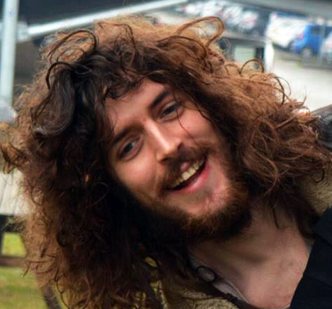

---
# Feel free to add content and custom Front Matter to this file.
# To modify the layout, see https://jekyllrb.com/docs/themes/#overriding-theme-defaults

layout: home
title: About me
---

**Name:** Nicola Davanzo

**Birth date:** 12 March 1992

## PhD

I'm a PhD student in Computer Science within [Laboratorio di Informatica Musicale](https://www.lim.di.unimi.it/) at University of Milan, Italy. My research project is about **Development and testing of accessible Digital Musical Instruments dedicated to quadriplegic users**. Thus, instruments playable hands-free, exploiting unconventional interaction channels such as eye tracking, mouth position tracking, breath pressure, head movement.

## Master degree

I've got my **Master Degree in Computer Engineering (2018)** at University of Pavia, Italy, following a course entitled *Computer Science and Multimedia*. My Master Thesis project is entitled *Development and testing of graphical Interfaces for gaze-controlled musical instruments*: a study and the development of virtual Digital Musical Instruments (DMI) operated through an eye tracker and a switch. The main focus of the project was developing an instrument suitable for those who cannot use their hands (useful both for disabled people and for musicians who want to play more than one instrument at a time). The instrument **Netytar** was born from this project. From this thesis work, a paper was extracted and presented at *ETRA COGAIN 2018* (Warsaw, June '18).

## Bachelor degree

I've got my **Bachelor Degree in Ingegneria Elettronica/Informatica (2015)** at University of Pavia, Italy. My Bachelor Thesis project is entitled *Development of a softwa for writing using an eyetracker*.

Beh insomma
