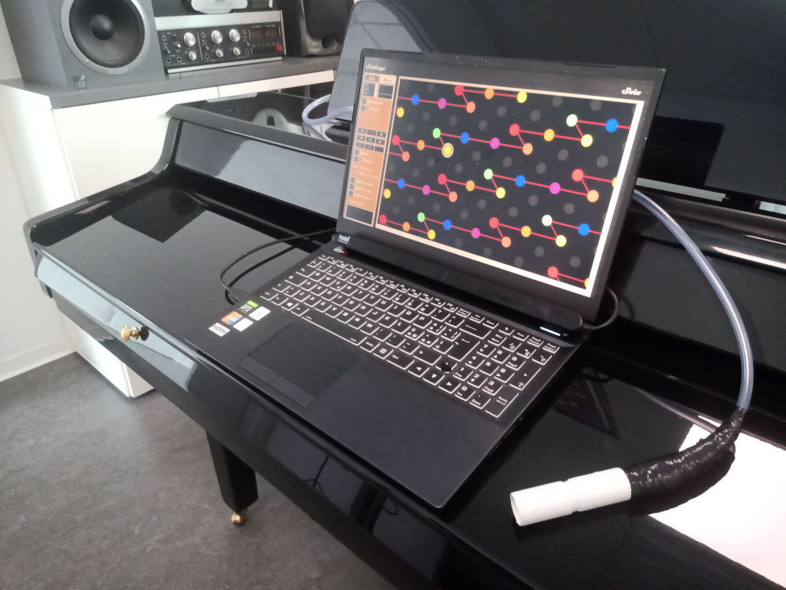

# Netytar

Netytar is a software Accessible Digital Musical Instrument controlled by gaze pointing and breath.

It is suitable for musicians having a quadriplegic disability, since it can be played without using their hands.

It's a monophonic instrument (i.e. able to play only one note at each time).

## Mapping

Gaze pointing controls note selection. It is detected through an eye tracker, a sensor which detects eye features through infrared cameras.

Breath controls note dynamics through a low pressure sensor. Netytar can somewhat be compared to a digital flute in this sense.

## Sensors

Netytar is compatible with Tobii Eye Trackers such as [Tobii Eye Tracker 5](https://gaming.tobii.com/product/eye-tracker-5/) (which have a cost of around 220€) or old, out of production Tobii 4C and Tobii EyeX.

Netytar's breath pressure sensor can be easily built DIY for under 30€.

§ GUIDE COMING SOON!
